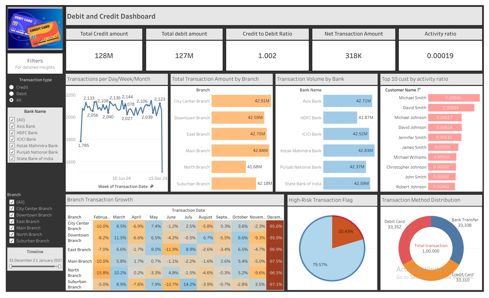

# Credit and Debit Analytics Dashboard

## Project Overview

This project presents an interactive Tableau dashboard developed to analyze customer debit and credit transactions. The dashboard provides insights into credit and debit transaction patterns, customer demographics, transaction channels, and regional performance.

The objective of this project is to help stakeholders monitor banking activity, identify trends, and support data-driven decision-making.

---

## Objectives

- Analyze debit and credit transactions
- Monitor customer transaction behaviour
- Compare transaction types across regions
- Identify high-value customers
- Visualize key banking KPIs

---

## Tools Used

- Tableau
- Microsoft Excel
- Data Visualization
- Data Cleaning

---

## Dataset

The dataset contains customer banking transaction details including:

- Customer Information
- Transaction Type
- Amount
- Date
- Region
- Payment Channel

---

## Dashboard Features

- KPI Cards
- Debit vs Credit Analysis
- Monthly Transaction Trend
- Regional Analysis
- Customer Insights
- Interactive Filters
- Dynamic Charts

---

## Key Insights

- Debit and credit transactions can be compared across different regions.
- Transaction trends help identify peak banking activity periods.
- Interactive filters allow users to drill down into customer segments.
- KPI cards provide a quick overview of banking performance.

---

## Dashboard Preview

---

## Repository Contents

- Dashboard.png
- debit and credit final.twbx
- Debit and Credit banking_data.xlsx

---

## Author

**Harshitha Vijayakumar**

Aspiring Data Analyst
